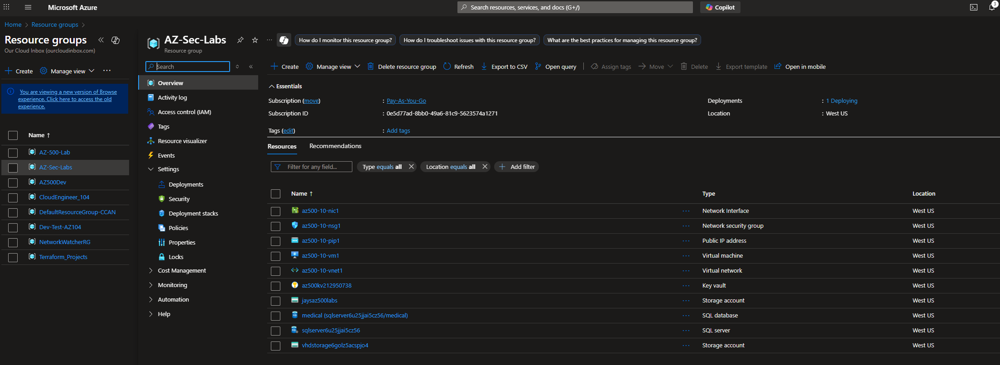
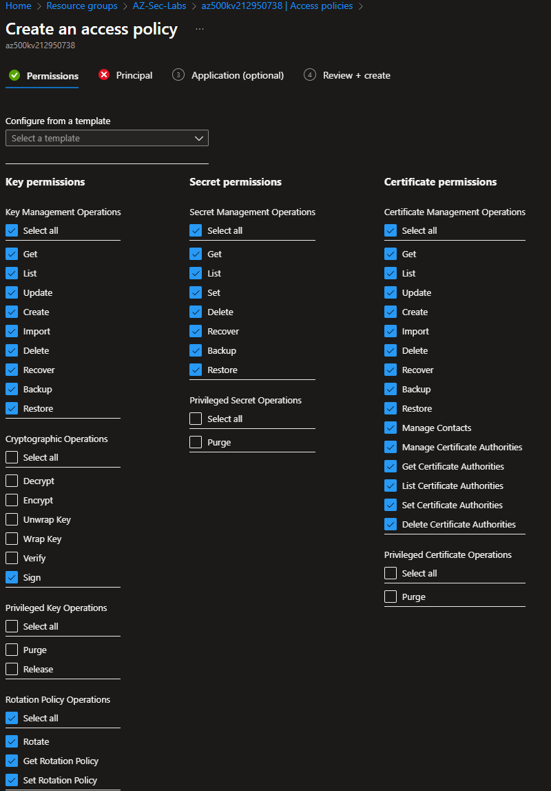
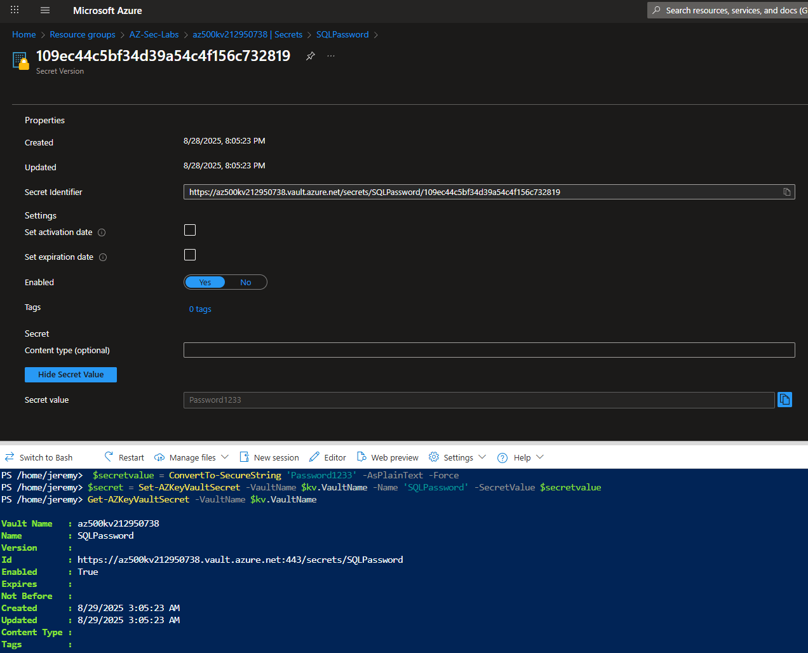
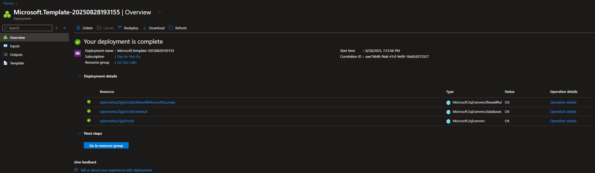
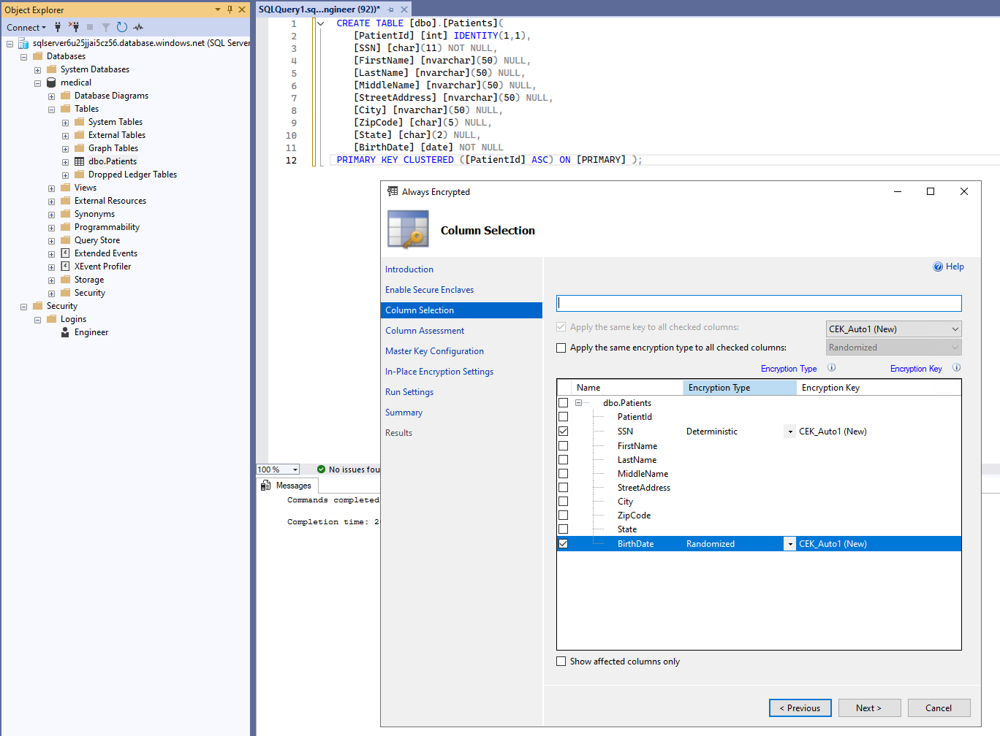
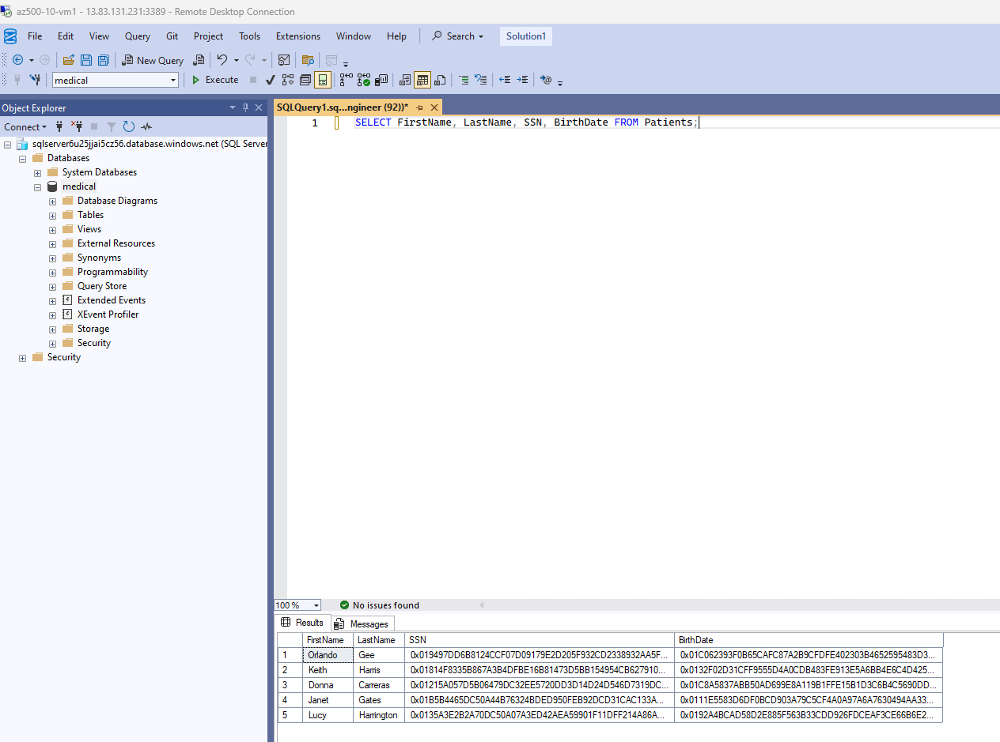
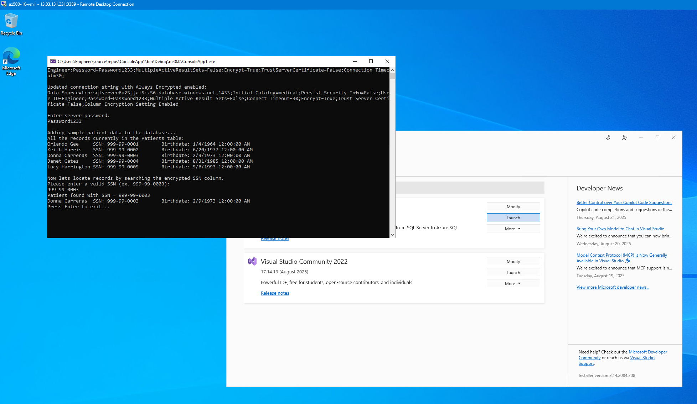

# 🔐 Azure Key Vault — Always Encrypted SQL Database  

**Type:** Microsoft Learn Lab — AZ-500 Lab  
**Skills:** Key Vault, Always Encrypted, SQL Security, Secret Management, ARM Templates, .NET Secure App Integration  

---

## 📌 Overview  
This project demonstrated how to implement **Always Encrypted with Azure SQL Database** using **Azure Key Vault** to protect sensitive fields such as **SSNs and birth dates**. By integrating SQL Server Management Studio (SSMS), Visual Studio, and Azure services, I secured database operations while storing cryptographic keys and secrets in Key Vault.  

The project also included **ARM template deployment**, **PowerShell automation**, and **C# code integration** to show end-to-end encryption and secure application access to the database.  

⚠️ **Note:** In this lab environment, secrets and keys were stored in **plain text** for demonstration purposes. In production, I would follow best practices such as:  
- Using **Azure Managed Identity** for apps  
- Enforcing **Key Vault firewall + private endpoints**

Additionally, since this lab required newer tooling:  
- I installed a later version of **Visual Studio** than the one used in the Microsoft Learn lab.  
- Because of this, I had to **modify parts of the C# code** to make it compatible with the updated runtime and libraries. 

---

## 🎯 Objectives  
- Deploy an **Azure SQL Database** and supporting resources using **ARM Templates**  
- Create and configure an **Azure Key Vault** for secret + key management  
- Register an **Azure AD Application** and assign access policies  
- Use **Always Encrypted with Key Vault keys** to secure SSNs and birthdates  
- Validate that encrypted columns cannot be read without the proper key access  
- Build and test a **C# .NET console app** to securely query encrypted data  

---

## 🛠️ What I Did  

1. **Deployed SQL environment via ARM Template**  
   - Provisioned SQL Server, Database, VM, Networking, and Storage  
   - Validated deployment through Azure portal  

2. **Configured Key Vault & Secrets**  
   - Created a Key Vault and generated encryption keys (`MyLabKey`)  
   - Stored SQL login password (`SQLPassword`) as a **secret**  
   - Assigned access policies to allow the registered SQL app to wrap/unwrap keys  

3. **Registered Azure AD Application**  
   - Registered **SQLApp** with client secret  
   - Granted permissions for Key Vault key/secret access  
   - Configured Key Vault access policies via PowerShell  

4. **Enabled Always Encrypted in SSMS**  
   - Created `Patients` table with columns: SSN, BirthDate, FirstName, LastName  
   - Applied **Deterministic Encryption** for SSNs and **Randomized Encryption** for BirthDates  
   - Bound encryption keys from **Azure Key Vault**  

5. **Built Console App with Key Vault Integration**  
   - Configured **ADO.NET connection strings** to support Always Encrypted  
   - Modified C# code to fetch secrets from **Key Vault**  
   - Queried and validated that encrypted SSNs remained protected while retrievable via the app  

6. **Validated Security**  
   - Confirmed direct SQL queries returned **ciphertext values**  
   - Verified Console App with Key Vault key access could **decrypt and query** records correctly  

---

## 📸 Screenshots  

- **Resource Group Deployment Overview**  
    

- **Key Vault Access Policy Configuration**  
    

- **Stored SQL Password Secret**  
    

- **ARM Template Deployment**  
    

- **Always Encrypted Column Setup in SSMS**  
    

- **Encrypted Query Validation**  
    

- **Console App Fetching Encrypted Data**  
    

---

## 📚 Key Takeaways  
- Always Encrypted ensures **sensitive data never leaves SQL Server in plaintext**.  
- Azure Key Vault provides a **secure key management layer** for database encryption.  
- SSNs were encrypted with deterministic encryption (supports equality searches).  
- BirthDates used randomized encryption (stronger but prevents indexing/filtering).  
- Access to encrypted data required **both SQL permissions + Key Vault access**.  

---

## 📖 References  
- [Microsoft Learn — Implementing Always Encrypted with Key Vault](https://microsoftlearning.github.io/AZ500-AzureSecurityTechnologies/Instructions/Labs/LAB_07_KeyVaultImplementingSecureDatabysettingupAlwaysEncrypted.html)  
- [Azure Key Vault Documentation](https://learn.microsoft.com/azure/key-vault/general/overview)  
- [Always Encrypted in SQL Server](https://learn.microsoft.com/sql/relational-databases/security/encryption/always-encrypted-database-engine)
